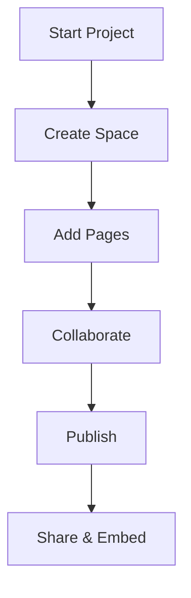

## Overview

Welcome to Globalinternet Documentation, your central hub for creating, organizing, and sharing project documentation. This platform serves as the default space where you manage all docs for your teams and projects. You get a clean, intuitive interface to build knowledge bases that scale with your needs, featuring real-time collaboration, version history, and seamless integrations.

<Callout kind="info">
Globalinternet uses brand color `#3B82F6` for consistent theming across your docs.
</Callout>

## Key Benefits

You benefit from powerful features that streamline documentation workflows for teams of any size.

<Columns cols={3}>
  <Card title="Centralized Organization" icon="folder" href="/docs/organization">
    Keep all project docs in one searchable space. Tag, categorize, and link pages effortlessly.
  </Card>
  <Card title="Team Collaboration" icon="users" href="/docs/collaboration">
    Enable real-time editing, comments, and approvals. Track changes with full version history.
  </Card>
  <Card title="Custom Integrations" icon="plug" href="/docs/integrations">
    Embed code snippets, APIs, and third-party tools directly into your pages.
  </Card>
</Columns>

## Getting Oriented with the Interface

Start by familiarizing yourself with the main areas. Follow these steps to set up your first space.

<Steps>
  <Step title="Create Your Space" icon="plus">
    Navigate to the dashboard and click `New Space`. Enter a name like `MyProjectDocs` and select a template.
  </Step>
  <Step title="Add Your First Page" icon="file-text">
    From the sidebar, choose `New Page`. Use the editor to add headings, code, and components.
  </Step>
  <Step title="Invite Team Members" icon="user-plus">
    Go to `Settings > Members` and add emails. Set roles like `Editor` or `Viewer`.
  </Step>
  <Step title="Publish and Share" icon="share-2">
    Click `Publish` to make it live. Copy the shareable link or embed code.
  </Step>
</Steps>

## Customization Options

Tailor the platform to your workflow using tabs for different customization paths.

<Tabs>
  <Tab title="Visual Themes" icon="palette">
    Customize colors and layouts in `Settings > Appearance`. Set primary to `#3B82F6`.

    ```javascript
    // Example theme config
    const theme = {
      primary: '#3B82F6',
      secondary: '#1E40AF'
    };
    ```
  </Tab>
  <Tab title="API Integrations" icon="code">
    Connect via REST API for automation.

    <CodeGroup tabs="JavaScript,cURL">
      ```javascript
      const response = await fetch('https://api.globalinternet.com/docs/spaces', {
        headers: { Authorization: `Bearer ${API_KEY}` }
      });
      const spaces = await response.json();
      ```
      ```bash
      curl -H "Authorization: Bearer $API_KEY" \
           https://api.globalinternet.com/docs/spaces
      ```
    </CodeGroup>
  </Tab>
  <Tab title="Embed Snippets" icon="codepen">
    Embed dynamic content from external services.
  </Tab>
</Tabs>

## Advanced Workflow



<Expandable title="Frequently Asked Questions" default-open="false">
  ### Can I export my docs?
  Yes, export to Markdown, PDF, or HTML via `Settings > Export`.

  ### What about permissions?
  Use granular roles: Owner, Editor, Viewer, and custom permissions.

  ### Is there version control?
  Every change saves automatically with diff views and rollback.
</Expandable>

This setup ensures you organize documentation efficiently while scaling with your projects. Explore the sidebar for more guides.